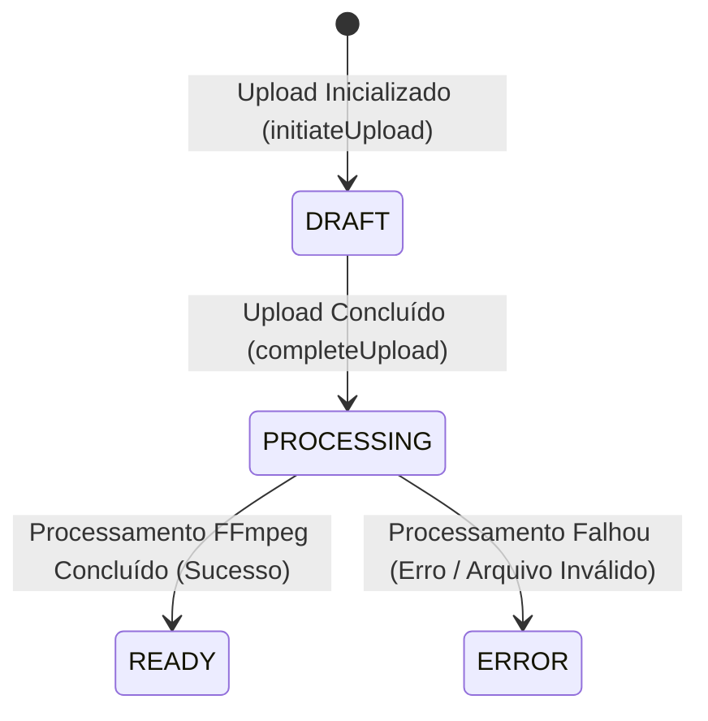

# Technical Decisions — Phase 03: Upload e Processamento de Vídeos

Este documento registra as decisões de arquitetura e tecnologia tomadas para a Fase 03 do StreamTube, justificando a escolha das tecnologias e estratégias para upload de grandes arquivos, processamento assíncrono e streaming.

---

## TD-01: Estratégia de Upload para Arquivos Grandes (até 10GB)

**Scope:** Cross-layer (API / Storage / Client)

**Capability:** Upload de vídeos de até 10GB sem travar o sistema (sem segurar a API durante o envio)

**Context:** Fazer upload de arquivos de até 10GB através do servidor HTTP tradicional da API bloqueia a thread do Node.js, esgota a memória do container devido a buffering e pode causar falhas em conexões instáveis sem possibilidade de retomada.

**Options:**

### Option A: Upload direto pela API (Stream Proxy)
- O cliente envia o arquivo via `multipart/form-data` para a API NestJS, que faz o streaming dele diretamente para o S3 à medida que recebe.
- **Pros:** Mais simples de implementar do ponto de vista do frontend; centraliza toda a lógica de autenticação e validação no NestJS.
- **Cons:** Bloqueia a banda e sockets do NestJS por muito tempo; alto risco de timeout; alto consumo de CPU e memória sob concorrência; nenhuma resiliência se a conexão cair no meio de um upload de 10GB.

### Option B: S3 Presigned Multipart Upload (Upload Direto ao Storage)
- O backend atua apenas como coordenador de segurança: gera URLs pré-assinadas para as partes do arquivo. O cliente divide o vídeo em blocos (ex: 10MB a 100MB), faz o upload de cada bloco diretamente ao S3/MinIO e, ao final, chama uma rota de finalização no NestJS.
- **Pros:** Offloads completo do tráfego do arquivo da API para o Object Storage; suporte nativo a uploads resilientes (retomada de partes falhas); suporta arquivos de 10GB de forma extremamente eficiente; largura de banda da API não é afetada.
- **Cons:** Exige que o cliente faça a lógica de divisão e envio das partes; fluxo de APIs mais complexo (initiate -> presign parts -> complete).

**Recommendation:** **Option B (S3 Presigned Multipart Upload)** — É a única abordagem escalável e robusta para uploads de até 10GB, garantindo que o servidor NestJS continue atendendo requisições normais sem latência ou vazamento de memória.

**Decision:** B (S3 Presigned Multipart Upload)

---

## TD-02: Tecnologia de Fila de Processamento

**Scope:** Infrastructure / Backend

**Capability:** Fila de processamento em segundo plano e um worker que a consome

**Context:** Após o upload do vídeo, a extração de metadados e geração de thumbnail são tarefas assíncronas que exigem processamento pesado e devem ser colocadas em fila para execução.

**Options:**

### Option A: RabbitMQ (Broker AMQP)
- Broker de mensageria clássico.
- **Pros:** Muito robusto, agnóstico a linguagem, excelente controle de roteamento.
- **Cons:** Configuração e infraestrutura pesadas para as necessidades do projeto; curva de aprendizado alta; sem suporte oficial nativo no ecossistema NestJS tão fluído quanto BullMQ para rastreamento fino de progresso/estado.

### Option B: BullMQ (Redis-based Queue)
- Fila baseada em Redis específica para ecossistema Node.js / TypeScript.
- **Pros:** Integração nativa e oficial do NestJS (`@nestjs/bullmq`); alta performance graças ao Redis; suporta tentativas automáticas, atrasos, limites de concorrência, priorização, relatórios de progresso em tempo real e parent-child jobs.
- **Cons:** Requer Redis na stack de infraestrutura, que precisa ser configurado com persistência para evitar perda de dados.

### Option C: PG-Boss (PostgreSQL-based Queue)
- Fila baseada em banco relacional usando PostgreSQL.
- **Pros:** Não adiciona nenhuma infraestrutura nova (já usamos PostgreSQL).
- **Cons:** Polling constante no PostgreSQL adiciona carga desnecessária ao banco; menos recursos de concorrência e monitoramento nativos se comparados a BullMQ.

**Recommendation:** **Option B (BullMQ + Redis)** — Combina facilidade de desenvolvimento, excelente suporte em NestJS, e alta performance para filas de trabalho baseadas em eventos no ecossistema Node.js.

**Decision:** B (BullMQ + Redis)

---

## TD-03: Arquitetura do Worker de Vídeo

**Scope:** Infrastructure / Deployment

**Capability:** Processamento automático pós-upload

**Context:** O processamento com FFmpeg consome muita CPU. O worker que consome a fila e processa os vídeos precisa rodar sem impactar o servidor de API que atende aos usuários.

**Options:**

### Option A: Worker In-Process (Dentro do container da API)
- A própria aplicação NestJS da API inicializa o processador de fila BullMQ em segundo plano.
- **Pros:** Monolito simples, menos containers para gerenciar no Docker Compose.
- **Cons:** Um processamento de FFmpeg concorrente pode deixar a API NestJS lenta ou indisponível devido ao uso de 100% de CPU.

### Option B: Container Separado (Worker Dedicado)
- Um container Docker dedicado sobe a mesma imagem/código do backend, mas é configurado em modo Worker (não expõe porta HTTP e apenas inicializa os processadores de fila da BullMQ).
- **Pros:** Isolamento de recursos de hardware (limites de CPU/Memória por container); escalabilidade independente (podemos subir mais Workers sem multiplicar a API); falhas severas no FFmpeg não derrubam a API HTTP.
- **Cons:** Aumenta ligeiramente a complexidade do Docker Compose.

**Recommendation:** **Option B (Container Separado)** — Garante a resiliência e a responsividade da API, isolando o consumo intensivo de CPU do processamento de vídeo.

**Decision:** B (Container Separado)

---

## TD-04: Extração de Metadados e Thumbnail (FFmpeg / ffprobe)

**Scope:** Backend (Worker)

**Capability:** Processamento automático pós-upload (duração/metadados e thumbnail)

**Context:** Precisamos ler a duração do vídeo, resolução e extrair um frame (geralmente no segundo 1) para gerar a imagem de thumbnail em formato JPG.

**Options:**

### Option A: Uso de CLI FFmpeg nativo via child_process
- Executar os comandos diretamente no terminal usando `exec` ou `spawn` do Node.js.
- **Pros:** Zero dependências NPM adicionais.
- **Cons:** Muito propenso a erros de sintaxe de linha de comando; difícil tratamento de erros estruturados; parsing manual de saídas JSON do `ffprobe`.

### Option B: fluent-ffmpeg (Wrapper Node.js)
- Biblioteca wrapper para FFmpeg/ffprobe.
- **Pros:** API fluente em TypeScript para configurar comandos, extração de frames e leitura de metadados; manipulação de eventos nativos de progresso e erro.
- **Cons:** Depende da instalação física do FFmpeg e ffprobe no container Docker.

**Recommendation:** **Option B (fluent-ffmpeg)** — Padroniza a integração com as ferramentas do sistema operacional e reduz drasticamente a chance de falhas no tratamento de saídas de processo.

**Decision:** B (fluent-ffmpeg)

---

## TD-05: Estratégia de URL Única para Vídeo

**Scope:** Database / API

**Capability:** URL única por vídeo, sem conflito

**Context:** Os vídeos precisam de um identificador público na URL que seja seguro, curto e não sequencial.

**Options:**

### Option A: UUIDv4 (ex: `e74bb70e-f633-4f9e-aef3-0ff7e2501a2f`)
- Gerado automaticamente pelo PostgreSQL ou NestJS.
- **Pros:** Unicidade garantida por design; suporte nativo no TypeORM.
- **Cons:** Longo, feio e pouco amigável para URLs de compartilhamento de vídeo.

### Option B: IDs Numéricos Sequenciais (ex: `/videos/42`)
- Chave primária padrão da tabela.
- **Pros:** Muito simples.
- **Cons:** Extremamente fácil de adivinhar (vazando volume de dados e permitindo raspagem em massa); não amigável.

### Option C: Short ID Seguro (ex: Slug de 10 caracteres como `dQw4w9WgXcQ`)
- Gerar uma string aleatória usando um alfabeto seguro para URL (ex: `nanoid` ou algoritmo customizado com `crypto.randomBytes`).
- **Pros:** Curto, limpo, não sequencial, seguro contra scraping indiscriminado, idêntico ao padrão de grandes plataformas (YouTube/Vimeo).
- **Cons:** Chance microscópica de colisão que exige uma restrição de unicidade (`UNIQUE`) no banco de dados e tratamento de erros no cadastro.

**Recommendation:** **Option C (Short ID Seguro)** — Proporciona a melhor experiência de URL de compartilhamento, combinando segurança com estética. Usaremos um slug de 10 a 12 caracteres.

**Decision:** C (Short ID Seguro)

---

## TD-06: Estratégia de Streaming e Reprodução

**Scope:** API / Storage

**Capability:** Reprodução via streaming (sem exigir o download completo) e download do vídeo

**Context:** Um vídeo de até 10GB deve começar a tocar imediatamente. O streaming exige suporte a requisições HTTP Range (status 206 Partial Content).

**Options:**

### Option A: Streaming via Proxy na API
- O cliente solicita o vídeo à API NestJS, que faz uma requisição de range ao MinIO/S3 e repassa o stream ao cliente.
- **Pros:** A API tem controle total de acesso a cada chunk; esconde o endpoint do S3 completamente.
- **Cons:** Sobrecarga gigante de rede e CPU na API NestJS; consome recursos de socket mantidos abertos durante toda a reprodução do vídeo.

### Option B: Redirecionamento para URL Pré-Assinada de GET (S3/MinIO)
- Quando o cliente acessa a URL do vídeo, a API gera uma URL de leitura pré-assinada do S3 (com expiração curta, ex: 1 hora) e retorna um redirecionamento HTTP `302 Found`. O navegador do cliente se conecta diretamente ao S3 para buscar o vídeo.
- **Pros:** O S3/MinIO suporta requisições HTTP Range (206 Partial Content) nativamente de forma ultra-otimizada; zero consumo de banda ou conexões no NestJS durante a reprodução do vídeo; muito escalável.
- **Cons:** O cliente expõe o host do S3/MinIO na aba de Network do navegador (aceitável para nossa arquitetura).

**Recommendation:** **Option B (Redirecionamento para URL Pré-Assinada)** — Permite que a infraestrutura de Object Storage (que é otimizada para servir arquivos estáticos e suportar Range Requests) cuide do streaming pesado de forma direta, protegendo a API NestJS.

**Decision:** B (Redirecionamento para URL Pré-Assinada)

---

## TD-07: Ciclo de Status do Vídeo e Tratamento de Erros

**Scope:** Database / Backend

**Capability:** Ciclo de status do vídeo (rascunho -> processando -> pronto/erro) refletido no banco

**Context:** O upload e processamento ocorrem em várias etapas assíncronas. Precisamos manter o status do vídeo consistente no banco de dados.

**State Machine:**

**Workflow:**
1. **DRAFT:** Quando o cliente inicia o upload via API, o registro do vídeo é criado no banco como `DRAFT`.
2. **PROCESSING:** Ao completar o upload no S3, o cliente chama a API de finalização. O status muda para `PROCESSING` e o job é enviado para a fila do worker.
3. **READY / ERROR:** O worker processa o arquivo. Em caso de sucesso, atualiza para `READY` salvando metadados (duração, resolução, codec) e caminhos finais do vídeo e da thumbnail. Se ocorrer um erro no FFmpeg ou download, o status é alterado para `ERROR` com a mensagem descritiva salva nos metadados.

**Decision:** Implementar o status como um ENUM no banco de dados, com logs estruturados do job em caso de transição para o estado `ERROR`.
