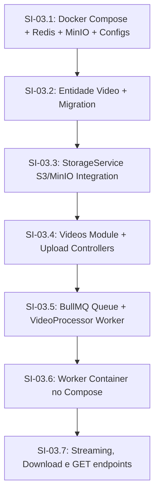

# Phase 03 — Upload e Processamento de Vídeos

## Objective

Implementar por completo a Fase 03 — Upload e Processamento de Vídeos do StreamTube, abrangendo o armazenamento de arquivos grandes em Object Storage local (MinIO), fila assíncrona (BullMQ + Redis), worker dedicado com FFmpeg/ffprobe, streaming de vídeo via Range Requests e URLs únicas curtas para os vídeos.

---

## Step Implementations

### SI-03.1 — Dependências, Variáveis de Ambiente e Infraestrutura Docker

**Description:** Instalar as dependências necessárias, criar os namespaces de configuração no NestJS (`storage` e `queue`), configurar a validação de variáveis de ambiente com Joi, e adicionar os serviços Redis e MinIO ao `compose.yaml`.

**Technical actions:**
- Instalar dependências de produção: `@aws-sdk/client-s3@^3.x`, `@aws-sdk/s3-request-presigner@^3.x`, `bullmq@^8.x`, `ioredis@^5.x`, `@nestjs/bullmq@^11.x`, `fluent-ffmpeg@^2.x`, `nanoid@^3.x`
- Instalar dependências de desenvolvimento: `@types/fluent-ffmpeg@^2.x`
- Modificar `Dockerfile.dev` para incluir `ffmpeg` na instalação do `apt`:
  `RUN apt update && apt install -y procps curl ffmpeg`
- Criar `src/config/storage.config.ts`:
  - Namespace `storage`
  - Variáveis: `STORAGE_ENDPOINT` (ex: `http://storage:9000`), `STORAGE_ACCESS_KEY` (ex: `minioadmin`), `STORAGE_SECRET_KEY` (ex: `minioadmin`), `STORAGE_BUCKET_VIDEOS` (ex: `streamtube-videos`), `STORAGE_FORCE_PATH_STYLE` (boolean, default `true`)
- Criar `src/config/queue.config.ts`:
  - Namespace `queue`
  - Variáveis: `REDIS_HOST` (default `'redis'`), `REDIS_PORT` (default `6379`)
- Atualizar `src/config/env.validation.ts` com as novas variáveis do Joi schema.
- Atualizar `.env.example` com valores para MinIO e Redis.
- Modificar `nestjs-project/compose.yaml`:
  - Adicionar serviço `redis` (imagem `redis:7-alpine`) com healthcheck.
  - Adicionar serviço `storage` (imagem `minio/minio`) rodando o comando `server /data --console-address ":9001"`, mapeando as portas `9000:9000` (API) e `9001:9001` (Console), com healthcheck.
  - Atualizar o serviço `nestjs-api` para depender de `db`, `mailpit`, `redis` e `storage`.

**Dependencies:** Nenhuma (Fase 02 concluída)

**Acceptance criteria:**
- O projeto compila e inicializa. Todos os containers (`db`, `mailpit`, `redis`, `storage`, `nestjs-api`) sobem com status `running`.
- MinIO está disponível na porta 9000 e Redis na porta 6379 da rede interna.

---

### SI-03.2 — Entidade Video e Migration no Banco de Dados

**Description:** Criar a tabela `videos` com relacionamento ManyToOne com `Channel`, e gerar a correspondente migration do TypeORM.

**Technical actions:**
- Criar `src/videos/entities/video.entity.ts` com as colunas:
  - `id`: uuid, primary key.
  - `slug`: varchar(20), único e indexado.
  - `title`: varchar(255).
  - `status`: enum (`DRAFT`, `PROCESSING`, `READY`, `ERROR`), padrão `DRAFT`.
  - `original_key`: varchar(255), nullable (caminho do vídeo no S3).
  - `thumbnail_key`: varchar(255), nullable (caminho da thumbnail no S3).
  - `duration`: integer, nullable (duração em segundos).
  - `width`: integer, nullable.
  - `height`: integer, nullable.
  - `codec`: varchar(50), nullable.
  - `error_message`: text, nullable (detalhes se o processamento falhar).
  - `channel_id`: uuid (FK → `channels`, `onDelete: CASCADE`).
  - `created_at` e `updated_at`: timestamps normais.
- Definir o relacionamento `@ManyToOne(() => Channel, channel => channel.videos)` na entidade `Video` (e opcionalmente a relação inversa em `Channel`).
- Gerar a migration: `npm run migration:generate -- src/database/migrations/CreateVideos` e revisar o arquivo SQL gerado.

**Tests:**
| File | Layer | Verifies |
|------|-------|----------|
| `src/videos/entities/video.entity.integration-spec.ts` | Integration | Valida restrições de nulidade, unicidade de slug, chave estrangeira com canais e cascade no delete. |

**Dependencies:** SI-03.1

**Acceptance criteria:**
- Executar `npm run migration:run` roda a nova migration sem erros.
- A tabela `videos` é criada com todas as restrições corretas no banco de dados.

---

### SI-03.3 — Storage Service (S3/MinIO Integration)

**Description:** Implementar um serviço encapsulado para lidar com a comunicação com o S3/MinIO, incluindo uploads multipartes e URLs pré-assinadas.

**Technical actions:**
- Criar `src/storage/storage.module.ts` e `src/storage/storage.service.ts`.
- No `StorageService`:
  - Instanciar o `S3Client` usando a configuração injetada de `storageConfig`.
  - No `onModuleInit`, verificar se o bucket de vídeos existe; se não existir, criá-lo e configurar políticas públicas para leitura ou manter privado (mantê-lo privado é melhor, pois serviremos URLs pré-assinadas de GET temporárias).
  - Método `initiateMultipartUpload(key: string, contentType: string): Promise<string>` -> Retorna o `UploadId`.
  - Método `generatePresignedUploadPartUrl(key: string, uploadId: string, partNumber: number): Promise<string>` -> Retorna a URL pré-assinada de upload de parte.
  - Método `completeMultipartUpload(key: string, uploadId: string, parts: { partNumber: number, etag: string }[]): Promise<void>`.
  - Método `generatePresignedGetUrl(key: string, expiresInSeconds?: number, filename?: string): Promise<string>` -> Gera URL para streaming ou download (usando `ResponseContentDisposition` para downloads).
  - Método `uploadBuffer(key: string, buffer: Buffer, contentType: string): Promise<void>` -> Usado para enviar a thumbnail gerada pelo worker.
  - Método `downloadToLocal(key: string, localPath: string): Promise<void>` -> Baixa o vídeo do S3 para o disco local do worker para processamento FFmpeg.

**Tests:**
| File | Layer | Verifies |
|------|-------|----------|
| `src/storage/storage.service.integration-spec.ts` | Integration | Verifica a conexão com o MinIO real rodando no compose, criando um arquivo temporário, testando multipart e baixando arquivos. |

**Dependencies:** SI-03.2

**Acceptance criteria:**
- O bucket é criado automaticamente se não existir.
- Arquivos podem ser carregados via Multipart e recuperados com sucesso usando o `StorageService` integrado ao MinIO real.

---

### SI-03.4 — Vídeos Controller/Service e Upload Coordination

**Description:** Implementar a lógica de negócios e as rotas para inicializar, assinar partes e concluir uploads de vídeos.

**Technical actions:**
- Criar `src/videos/videos.module.ts`, `src/videos/videos.controller.ts` e `src/videos/videos.service.ts`.
- Importar `StorageModule` e `UsersModule` / `ChannelsModule` onde necessário.
- Implementar os seguintes DTOs em `src/videos/dto/`:
  - `InitUploadDto` `{ title: string }`
  - `PresignPartsDto` `{ videoId: string; uploadId: string; key: string; partNumbers: number[] }`
  - `CompleteUploadDto` `{ videoId: string; uploadId: string; key: string; parts: Array<{ partNumber: number; etag: string }> }`
- No `VideosService`:
  - Gerar slug único de 11 caracteres para o vídeo usando `nanoid` (customAlphabet).
  - Método `initiateVideoUpload(userId: string, title: string)`:
    - Busca o canal do usuário (relação 1:1, lança erro se não possuir canal).
    - Cria o vídeo no banco com status `DRAFT` e chave original temporária `uploads/<slug>/video.mp4`.
    - Chama o `StorageService.initiateMultipartUpload` para obter o `UploadId`.
    - Retorna `{ videoId: string, uploadId: string, key: string, slug: string }`.
  - Método `generatePresignedParts(userId: string, dto: PresignPartsDto)`:
    - Verifica se o vídeo pertence ao canal do usuário autenticado.
    - Gera URLs pré-assinadas para as partes especificadas.
  - Método `completeVideoUpload(userId: string, dto: CompleteUploadDto)`:
    - Verifica a propriedade do vídeo.
    - Chama `StorageService.completeMultipartUpload`.
    - Atualiza o status do vídeo para `PROCESSING`.
    - Publica um job na fila `video-processing` com os dados do vídeo.
- Configurar rotas autenticadas com `JwtAuthGuard` global no `VideosController`.

**Tests:**
| File | Layer | Verifies |
|------|-------|----------|
| `src/videos/videos.service.spec.ts` | Unit | Valida a lógica de negócios, criação do registro em DRAFT, geração de slug, autorização com base no canal e publicação na fila. |
| `test/videos-upload.e2e-spec.ts` | E2E | Testa o ciclo HTTP completo de upload coordenado: inicializar -> presign -> completar com mocks apropriados do S3. |

**Dependencies:** SI-03.3

**Acceptance criteria:**
- Endpoints respondem corretamente de acordo com os contratos da API.
- Usuários só podem inicializar/modificar vídeos do seu próprio canal.
- Após concluir o upload, o status no banco é `PROCESSING` e a fila BullMQ recebe o job.

---

### SI-03.5 — Fila BullMQ e Worker de Processamento (FFmpeg)

**Description:** Configurar a fila BullMQ, implementar o `VideoProcessor` para realizar o download do vídeo, rodar o `ffprobe` para extrair metadados, o `ffmpeg` para gerar a thumbnail, salvar a thumbnail no MinIO/S3 e atualizar o status do vídeo no banco de dados.

**Technical actions:**
- Registrar `BullModule.forRootAsync` no `AppModule` injetando `queueConfig` para se conectar ao Redis.
- Registrar a fila `video-processing` no `VideosModule`.
- Criar `src/videos/processors/video.processor.ts` herdando de `WorkerHost`.
- No `VideoProcessor.process(job: Job)`:
  - Payload: `{ videoId: string; videoKey: string }`.
  - Buscar entidade `Video` pelo `videoId` e carregar a relação de canal.
  - Criar caminhos temporários no sistema (ex: `/tmp/video-<uuid>.mp4` e `/tmp/thumb-<uuid>.jpg`).
  - Chamar `StorageService.downloadToLocal` para baixar o arquivo do S3 para a máquina local do worker.
  - Utilizar `fluent-ffmpeg` / `ffprobe` para:
    - Extrair a duração (`format.duration`), resolução (largura/altura) e codec de vídeo.
    - Extrair um frame no segundo 1 para salvar a thumbnail como JPG na pasta temporária.
  - Chamar `StorageService.uploadBuffer` para fazer o upload da thumbnail gerada para `thumbnails/<slug>/thumb.jpg`.
  - Atualizar a entidade `Video` no banco de dados:
    - `status = 'READY'`
    - `original_key` = `videoKey`
    - `thumbnail_key` = `thumbnails/<slug>/thumb.jpg`
    - `duration` = duração em segundos (arredondado para inteiro)
    - `width` / `height` = resolução
    - `codec` = codec de vídeo
  - Caso ocorra algum erro em qualquer etapa (S3, FFmpeg, banco):
    - Capturar o erro e definir o status do vídeo para `ERROR`.
    - Salvar a mensagem de erro formatada em `error_message`.
  - Limpar os arquivos temporários criados em `/tmp` tanto no sucesso quanto no erro.

**Tests:**
| File | Layer | Verifies |
|------|-------|----------|
| `src/videos/processors/video.processor.integration-spec.ts` | Integration | Processa um arquivo mp4 real curto colocado temporariamente no MinIO, verifica a extração de metadados, geração de thumbnail e atualização correta do status para READY no banco de dados PostgreSQL. |

**Dependencies:** SI-03.4

**Acceptance criteria:**
- Ao enviar um vídeo real para processamento, o worker gera a thumbnail, extrai metadados estruturados e atualiza o status para `READY`.
- Se o arquivo for corrompido ou inválido, o status muda para `ERROR` com log do erro salvo na tabela.

---

### SI-03.6 — Container Separado do Worker no Docker Compose

**Description:** Configurar um container separado no `compose.yaml` para executar a aplicação no modo Worker (apenas escutando filas do BullMQ, sem abrir servidor HTTP na porta 3000), garantindo isolamento de CPU.

**Technical actions:**
- Atualizar o arquivo `src/main.ts` para que, caso a variável de ambiente `WORKER_MODE=true` esteja definida:
  - Chame `NestFactory.createApplicationContext(AppModule)` em vez de `NestFactory.create(AppModule)`. Isso inicializa o contexto DI do NestJS e ativa os processadores do BullMQ sem escutar em portas TCP (não inicia o servidor Express).
- Adicionar o serviço `nestjs-worker` no `nestjs-project/compose.yaml`:
  - Construído a partir do mesmo `Dockerfile.dev` com o volume local montado.
  - Variáveis de ambiente: `WORKER_MODE=true`, `DB_HOST=db`, `REDIS_HOST=redis`, `STORAGE_ENDPOINT=http://storage:9000`, etc.
  - Dependência: `redis` (healthcheck), `db` (healthcheck), `storage` (healthcheck).
  - Sem mapeamento de portas de rede externas.

**Dependencies:** SI-03.5

**Acceptance criteria:**
- Ao subir o Docker Compose, o container `nestjs-worker` é iniciado em modo headless.
- Logs do `nestjs-worker` mostram a inicialização do contexto do NestJS e conexão correta com o Redis/BullMQ.

---

### SI-03.7 — Streaming, Download e Leitura do Vídeo

**Description:** Implementar endpoints para obter detalhes do vídeo, reprodução via streaming e download.

**Technical actions:**
- No `VideosController` e `VideosService`:
  - Rota `GET /videos/:slug`: Aberta ao público (anônimo). Busca o vídeo pelo slug. Se o status não for `READY`, lança erro `VideoNotReadyException` ou `NotFoundException` (a menos que seja o próprio dono visualizando, mas por enquanto mantemos público apenas para vídeos `READY`). Retorna os detalhes do vídeo.
  - Rota `GET /videos/:slug/stream`: Rota pública. Busca o vídeo, gera uma URL pré-assinada temporária de leitura (expira em 1 hora) e retorna um redirecionamento HTTP `302 Found` para o MinIO/S3.
  - Rota `GET /videos/:slug/download`: Rota pública. Busca o vídeo, gera uma URL pré-assinada temporária de download com a disposição do cabeçalho modificada para attachment, e redireciona (HTTP 302) o cliente.
- Definir os novos códigos de erro no exception filter, se houver.

**Tests:**
| File | Layer | Verifies |
|------|-------|----------|
| `src/videos/videos.controller.spec.ts` | Unit | Valida a geração de URLs e redirecionamentos apropriados nos endpoints de streaming e download. |
| `test/videos-delivery.e2e-spec.ts` | E2E | Testa a resposta HTTP 302 com o cabeçalho Location apontando para o MinIO tanto para stream quanto para download. |

**Dependencies:** SI-03.6

**Acceptance criteria:**
- Acessar `/videos/:slug/stream` redireciona com sucesso para a URL temporária do MinIO.
- O download baixa o arquivo com o nome original do objeto.

---

## Technical Specifications

### Data Model

#### Tabela `videos`
- `id`: `uuid` (Primary Key, default `gen_random_uuid()`)
- `slug`: `varchar(20)` (Unique, Indexed, Not Null)
- `title`: `varchar(255)` (Not Null)
- `status`: `varchar(50)` (Enum: `'DRAFT'`, `'PROCESSING'`, `'READY'`, `'ERROR'`) (Not Null, default `'DRAFT'`)
- `original_key`: `varchar(255)` (Nullable)
- `thumbnail_key`: `varchar(255)` (Nullable)
- `duration`: `integer` (Nullable)
- `width`: `integer` (Nullable)
- `height`: `integer` (Nullable)
- `codec`: `varchar(50)` (Nullable)
- `error_message`: `text` (Nullable)
- `channel_id`: `uuid` (Foreign Key -> `channels.id`, onDelete `CASCADE`, Not Null)
- `created_at`: `timestamp` (default `now()`, Not Null)
- `updated_at`: `timestamp` (default `now()`, Not Null)

---

### API Contracts

#### 1. Inicializar Upload
- **Path:** `POST /videos/upload/init`
- **Authentication:** Bearer JWT token (Required)
- **Request Body:**
  ```json
  {
    "title": "Minha Gameplay Incrível"
  }
  ```
- **Response Body (201 Created):**
  ```json
  {
    "videoId": "1a2b3c4d-5e6f-7g8h-9i0j-1k2l3m4n5o6p",
    "uploadId": "mp-upload-id-from-s3",
    "key": "uploads/7Y1zKx9Q3W0/video.mp4",
    "slug": "7Y1zKx9Q3W0"
  }
  ```

#### 2. Assinar Partes de Upload
- **Path:** `POST /videos/upload/presign-parts`
- **Authentication:** Bearer JWT token (Required)
- **Request Body:**
  ```json
  {
    "videoId": "1a2b3c4d-5e6f-7g8h-9i0j-1k2l3m4n5o6p",
    "uploadId": "mp-upload-id-from-s3",
    "key": "uploads/7Y1zKx9Q3W0/video.mp4",
    "partNumbers": [1, 2, 3]
  }
  ```
- **Response Body (200 OK):**
  ```json
  {
    "parts": [
      { "partNumber": 1, "url": "https://storage.streamtube.com/..." },
      { "partNumber": 2, "url": "https://storage.streamtube.com/..." },
      { "partNumber": 3, "url": "https://storage.streamtube.com/..." }
    ]
  }
  ```

#### 3. Concluir Upload
- **Path:** `POST /videos/upload/complete`
- **Authentication:** Bearer JWT token (Required)
- **Request Body:**
  ```json
  {
    "videoId": "1a2b3c4d-5e6f-7g8h-9i0j-1k2l3m4n5o6p",
    "uploadId": "mp-upload-id-from-s3",
    "key": "uploads/7Y1zKx9Q3W0/video.mp4",
    "parts": [
      { "partNumber": 1, "etag": "etag-1" },
      { "partNumber": 2, "etag": "etag-2" }
    ]
  }
  ```
- **Response Body (200 OK):**
  ```json
  {
    "videoId": "1a2b3c4d-5e6f-7g8h-9i0j-1k2l3m4n5o6p",
    "status": "PROCESSING"
  }
  ```

#### 4. Detalhes do Vídeo
- **Path:** `GET /videos/:slug`
- **Authentication:** None (Public)
- **Response Body (200 OK):**
  ```json
  {
    "id": "1a2b3c4d-5e6f-7g8h-9i0j-1k2l3m4n5o6p",
    "slug": "7Y1zKx9Q3W0",
    "title": "Minha Gameplay Incrível",
    "status": "READY",
    "duration": 180,
    "width": 1920,
    "height": 1080,
    "codec": "h264",
    "channel": {
      "id": "channel-uuid",
      "name": "Canal Principal",
      "nickname": "canal_principal"
    },
    "created_at": "2026-06-26T10:15:00Z"
  }
  ```

#### 5. Streaming (Redirecionamento)
- **Path:** `GET /videos/:slug/stream`
- **Authentication:** None (Public)
- **Response:** HTTP `302 Found`, header `Location` contendo a URL temporária pré-assinada do MinIO/S3 para ler o vídeo.

#### 6. Download (Redirecionamento)
- **Path:** `GET /videos/:slug/download`
- **Authentication:** None (Public)
- **Response:** HTTP `302 Found`, header `Location` contendo a URL temporária pré-assinada do MinIO/S3 com o parâmetro `response-content-disposition` configurado para fazer o download do arquivo.

---

### Authorization Matrix

| Endpoint | Guest (Anônimo) | User Autenticado | Dono do Vídeo / Canal |
|----------|-----------------|------------------|-----------------------|
| `POST /videos/upload/init` | ✗ 401 Unauthorized | ✓ 201 Created (Se tiver canal) | ✓ 201 Created |
| `POST /videos/upload/presign-parts` | ✗ 401 Unauthorized | ✗ 403 Forbidden | ✓ 200 OK |
| `POST /videos/upload/complete` | ✗ 401 Unauthorized | ✗ 403 Forbidden | ✓ 200 OK |
| `GET /videos/:slug` | ✓ 200 OK (Se READY) | ✓ 200 OK (Se READY) | ✓ 200 OK (Qualquer status)|
| `GET /videos/:slug/stream` | ✓ 302 Found (Se READY) | ✓ 302 Found (Se READY) | ✓ 302 Found |
| `GET /videos/:slug/download` | ✓ 302 Found (Se READY) | ✓ 302 Found (Se READY) | ✓ 302 Found |

---

### Error Catalog

- `CHANNEL_NOT_FOUND` (HTTP 404): O usuário autenticado não possui um canal configurado (necessário para ser proprietário do vídeo).
- `VIDEO_NOT_FOUND` (HTTP 404): O vídeo com o ID ou slug especificado não existe.
- `FORBIDDEN_VIDEO_ACCESS` (HTTP 403): O vídeo pertence a outro canal e o usuário autenticado não tem permissão para alterá-lo.
- `VIDEO_NOT_READY` (HTTP 400): O vídeo solicitado para streaming ou download ainda está em processamento ou falhou com erro.
- `STORAGE_UPLOAD_ERROR` (HTTP 500): Falha ao comunicar com o MinIO/S3 para iniciar ou concluir o upload.

---

### Events / Messages

#### BullMQ Job Payload (Fila: `video-processing`)
- **Job Name:** `'process'`
- **Data Shape:**
  ```typescript
  interface VideoProcessingJobPayload {
    videoId: string;
    videoKey: string;
  }
  ```

---

## Dependency Map



---

## Deliverables

1. **Infraestrutura Docker:** Redis, MinIO e Worker container configurados no `compose.yaml`.
2. **Dependências NPM:** Bibliotecas AWS SDK S3, BullMQ, ioredis, fluent-ffmpeg e nanoid instaladas.
3. **Esquema de Banco de Dados:** Tabela de `videos` criada via TypeORM migration.
4. **Módulo de Vídeos:**
   - Serviços de Upload Multipartes seguros integrados ao MinIO.
   - Gerador de Slugs curtos únicos.
   - Worker assíncrono que extrai metadados via ffprobe e thumbnails via ffmpeg.
   - Endpoints de streaming e download com HTTP Range natively servidos pelo redirecionamento S3.
5. **Testes de Qualidade:** Suíte de testes (unitários, integração, e2e) passando integralmente com 100% de sucesso.
